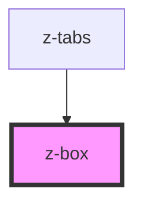

# z-box

<!-- Auto Generated Below -->

## Properties

| Property        | Attribute        | Description | Type                                                                                            | Default     |
| --------------- | ---------------- | ----------- | ----------------------------------------------------------------------------------------------- | ----------- |
| `align`         | `align`          |             | `"center" \| "flex-end" \| "flex-start"`                                                        | `undefined` |
| `as`            | `as`             |             | `string`                                                                                        | `undefined` |
| `background`    | `background`     |             | `string`                                                                                        | `undefined` |
| `block`         | `block`          |             | `boolean`                                                                                       | `undefined` |
| `border`        | `border`         |             | `string`                                                                                        | `undefined` |
| `borderColor`   | `border-color`   |             | `string`                                                                                        | `undefined` |
| `borderRadius`  | `border-radius`  |             | `string`                                                                                        | `undefined` |
| `borderStyle`   | `border-style`   |             | `string`                                                                                        | `undefined` |
| `borderWidth`   | `border-width`   |             | `string`                                                                                        | `undefined` |
| `boxShadow`     | `box-shadow`     |             | `string`                                                                                        | `undefined` |
| `columnGap`     | `column-gap`     |             | `string`                                                                                        | `undefined` |
| `cursor`        | `cursor`         |             | `string`                                                                                        | `undefined` |
| `flex`          | `flex`           |             | `string`                                                                                        | `undefined` |
| `gap`           | `gap`            |             | `string`                                                                                        | `undefined` |
| `h`             | `h`              |             | `string`                                                                                        | `undefined` |
| `justify`       | `justify`        |             | `"center" \| "flex-end" \| "flex-start" \| "space-around" \| "space-between" \| "space-evenly"` | `undefined` |
| `m`             | `m`              |             | `string`                                                                                        | `undefined` |
| `mb`            | `mb`             |             | `string`                                                                                        | `undefined` |
| `ml`            | `ml`             |             | `string`                                                                                        | `undefined` |
| `mr`            | `mr`             |             | `string`                                                                                        | `undefined` |
| `mt`            | `mt`             |             | `string`                                                                                        | `undefined` |
| `name`          | `name`           |             | `string`                                                                                        | `undefined` |
| `p`             | `p`              |             | `string`                                                                                        | `undefined` |
| `pb`            | `pb`             |             | `string`                                                                                        | `undefined` |
| `pl`            | `pl`             |             | `string`                                                                                        | `undefined` |
| `pointerEvents` | `pointer-events` |             | `string`                                                                                        | `undefined` |
| `pr`            | `pr`             |             | `string`                                                                                        | `undefined` |
| `pt`            | `pt`             |             | `string`                                                                                        | `undefined` |
| `row`           | `row`            |             | `boolean`                                                                                       | `undefined` |
| `rowGap`        | `row-gap`        |             | `string`                                                                                        | `undefined` |
| `w`             | `w`              |             | `string`                                                                                        | `undefined` |
| `wrap`          | `wrap`           |             | `boolean`                                                                                       | `undefined` |
| `zIndex`        | `z-index`        |             | `string`                                                                                        | `undefined` |

## Dependencies

### Used by

 - [z-tabs](../z-tabs)

### Graph

----------------------------------------------

*Built with [StencilJS](https://stenciljs.com/)*
