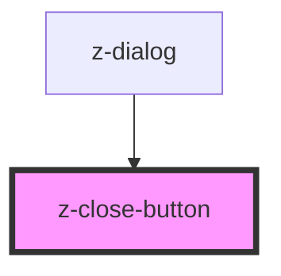

# z-close-button

<!-- Auto Generated Below -->

## Properties

| Property | Attribute | Description | Type     | Default     |
| -------- | --------- | ----------- | -------- | ----------- |
| `m`      | `m`       |             | `string` | `undefined` |
| `p`      | `p`       |             | `string` | `undefined` |

## Events

| Event   | Description | Type               |
| ------- | ----------- | ------------------ |
| `close` |             | `CustomEvent<any>` |

## Dependencies

### Used by

 - [z-dialog](../z-dialog)

### Graph

----------------------------------------------

*Built with [StencilJS](https://stenciljs.com/)*
