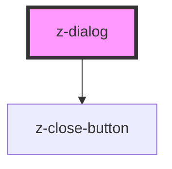

# z-dialog

<!-- Auto Generated Below -->

## Properties

| Property              | Attribute               | Description | Type                                                                                                                               | Default     |
| --------------------- | ----------------------- | ----------- | ---------------------------------------------------------------------------------------------------------------------------------- | ----------- |
| `disableOverlayClose` | `disable-overlay-close` |             | `boolean`                                                                                                                          | `undefined` |
| `hideCloseButton`     | `hide-close-button`     |             | `boolean`                                                                                                                          | `undefined` |
| `m`                   | `m`                     |             | `string`                                                                                                                           | `undefined` |
| `mb`                  | `mb`                    |             | `string`                                                                                                                           | `undefined` |
| `ml`                  | `ml`                    |             | `string`                                                                                                                           | `undefined` |
| `mr`                  | `mr`                    |             | `string`                                                                                                                           | `undefined` |
| `mt`                  | `mt`                    |             | `string`                                                                                                                           | `undefined` |
| `overlayColor`        | `overlay-color`         |             | `string`                                                                                                                           | `undefined` |
| `overlayOpacity`      | `overlay-opacity`       |             | `string`                                                                                                                           | `undefined` |
| `position`            | `position`              |             | `"bottom" \| "bottom-left" \| "bottom-right" \| "center" \| "center-left" \| "center-right" \| "top" \| "top-left" \| "top-right"` | `undefined` |

## Events

| Event   | Description | Type               |
| ------- | ----------- | ------------------ |
| `close` |             | `CustomEvent<any>` |

## Dependencies

### Depends on

- [z-close-button](../z-close-button)

### Graph

----------------------------------------------

*Built with [StencilJS](https://stenciljs.com/)*
