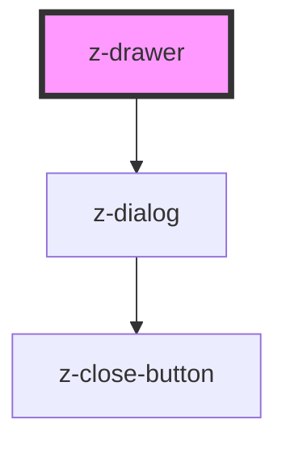

# z-drawer

<!-- Auto Generated Below -->

## Properties

| Property          | Attribute           | Description | Type                                     | Default     |
| ----------------- | ------------------- | ----------- | ---------------------------------------- | ----------- |
| `drawerHeight`    | `drawer-height`     |             | `string`                                 | `'30vh'`    |
| `drawerWidth`     | `drawer-width`      |             | `string`                                 | `'20vw'`    |
| `hideCloseButton` | `hide-close-button` |             | `boolean`                                | `undefined` |
| `overlayColor`    | `overlay-color`     |             | `string`                                 | `undefined` |
| `overlayOpacity`  | `overlay-opacity`   |             | `string`                                 | `undefined` |
| `position`        | `position`          |             | `"bottom" \| "left" \| "right" \| "top"` | `undefined` |

## Dependencies

### Depends on

- [z-dialog](../z-dialog)

### Graph

----------------------------------------------

*Built with [StencilJS](https://stenciljs.com/)*
