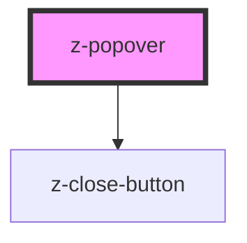

# z-popover

<!-- Auto Generated Below -->

## Properties

| Property          | Attribute           | Description | Type                                                                                                                                                                                                           | Default     |
| ----------------- | ------------------- | ----------- | -------------------------------------------------------------------------------------------------------------------------------------------------------------------------------------------------------------- | ----------- |
| `hideCloseButton` | `hide-close-button` |             | `boolean`                                                                                                                                                                                                      | `undefined` |
| `m`               | `m`                 |             | `string`                                                                                                                                                                                                       | `undefined` |
| `mb`              | `mb`                |             | `string`                                                                                                                                                                                                       | `undefined` |
| `ml`              | `ml`                |             | `string`                                                                                                                                                                                                       | `undefined` |
| `mr`              | `mr`                |             | `string`                                                                                                                                                                                                       | `undefined` |
| `mt`              | `mt`                |             | `string`                                                                                                                                                                                                       | `undefined` |
| `position`        | `position`          |             | `"\tauto" \| "auto-end" \| "auto-start" \| "bottom" \| "bottom-end" \| "bottom-start" \| "left" \| "left-end" \| "left-start" \| "right" \| "right-end" \| "right-start" \| "top" \| "top-end" \| "top-start"` | `undefined` |

## Events

| Event   | Description | Type               |
| ------- | ----------- | ------------------ |
| `close` |             | `CustomEvent<any>` |

## Dependencies

### Depends on

- [z-close-button](../z-close-button)

### Graph

----------------------------------------------

*Built with [StencilJS](https://stenciljs.com/)*
