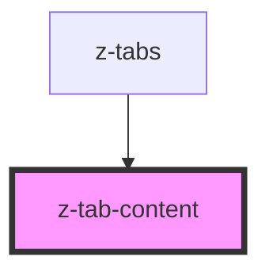

# z-tab-content

<!-- Auto Generated Below -->

## Dependencies

### Used by

 - [z-tabs](../z-tabs)

### Graph

----------------------------------------------

*Built with [StencilJS](https://stenciljs.com/)*
