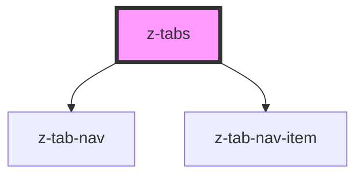

# z-tabs

<!-- Auto Generated Below -->

## Properties

| Property         | Attribute          | Description | Type      | Default     |
| ---------------- | ------------------ | ----------- | --------- | ----------- |
| `activeTabIndex` | `active-tab-index` |             | `number`  | `0`         |
| `contentHeight`  | `content-height`   |             | `string`  | `undefined` |
| `contentWidth`   | `content-width`    |             | `string`  | `undefined` |
| `m`              | `m`                |             | `string`  | `undefined` |
| `navItemsFit`    | `nav-items-fit`    |             | `boolean` | `undefined` |
| `navItemsWidth`  | `nav-items-width`  |             | `string`  | `undefined` |
| `p`              | `p`                |             | `string`  | `undefined` |
| `vertical`       | `vertical`         |             | `boolean` | `undefined` |

## Dependencies

### Depends on

- [z-tab-nav](../z-tab-nav)
- [z-tab-nav-item](../z-tab-nav-item)

### Graph

----------------------------------------------

*Built with [StencilJS](https://stenciljs.com/)*
