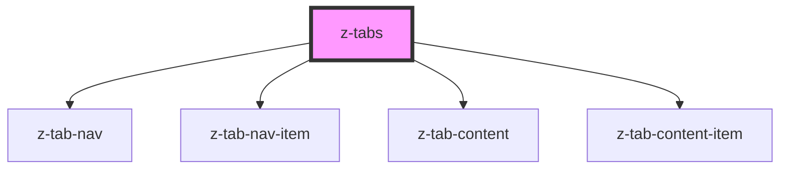

# z-tabs

<!-- Auto Generated Below -->

## Properties

| Property          | Attribute           | Description | Type        | Default     |
| ----------------- | ------------------- | ----------- | ----------- | ----------- |
| `data`            | --                  |             | `TabData[]` | `undefined` |
| `defaultTabIndex` | `default-tab-index` |             | `number`    | `0`         |
| `m`               | `m`                 |             | `string`    | `undefined` |
| `p`               | `p`                 |             | `string`    | `undefined` |

## Dependencies

### Depends on

- [z-tab-nav](../z-tab-nav)
- [z-tab-nav-item](../z-tab-nav-item)
- [z-tab-content](../z-tab-content)
- [z-tab-content-item](../z-tab-content-item)

### Graph

----------------------------------------------

*Built with [StencilJS](https://stenciljs.com/)*
