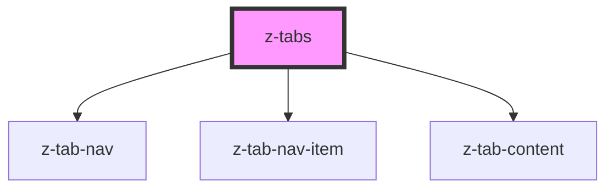

# z-tabs

<!-- Auto Generated Below -->

## Properties

| Property           | Attribute            | Description | Type      | Default     |
| ------------------ | -------------------- | ----------- | --------- | ----------- |
| `contentHeight`    | `content-height`     |             | `string`  | `undefined` |
| `contentWidth`     | `content-width`      |             | `string`  | `undefined` |
| `m`                | `m`                  |             | `string`  | `undefined` |
| `navItemsFit`      | `nav-items-fit`      |             | `boolean` | `undefined` |
| `navItemsWidth`    | `nav-items-width`    |             | `string`  | `undefined` |
| `p`                | `p`                  |             | `string`  | `undefined` |
| `selectedTabIndex` | `selected-tab-index` |             | `number`  | `0`         |
| `vertical`         | `vertical`           |             | `boolean` | `undefined` |

## Dependencies

### Depends on

- [z-tab-nav](../z-tab-nav)
- [z-tab-nav-item](../z-tab-nav-item)
- [z-tab-content](../z-tab-content)

### Graph

----------------------------------------------

*Built with [StencilJS](https://stenciljs.com/)*
